<!-- HEADER -->

  

<!-- HEADER -->

<!-- STATS -->

  

  
  

<!-- STATS -->

<!-- TOOLS -->

  
  
  
  
  
  
  
  
  
  
  
  
  
  
  
  
  
  

<!-- TOOLS -->

<!-- FOOTER -->

  

<!-- FOOTER -->
